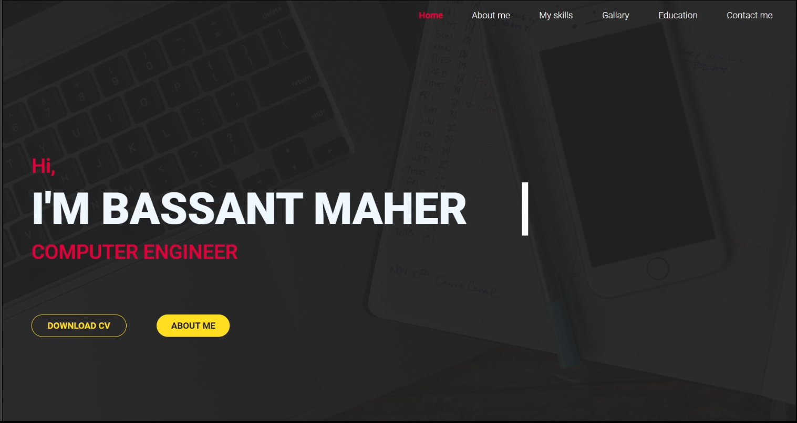
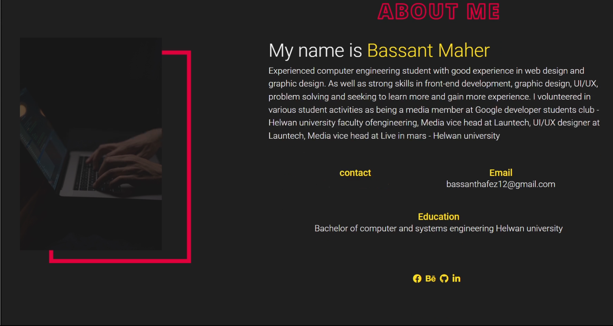
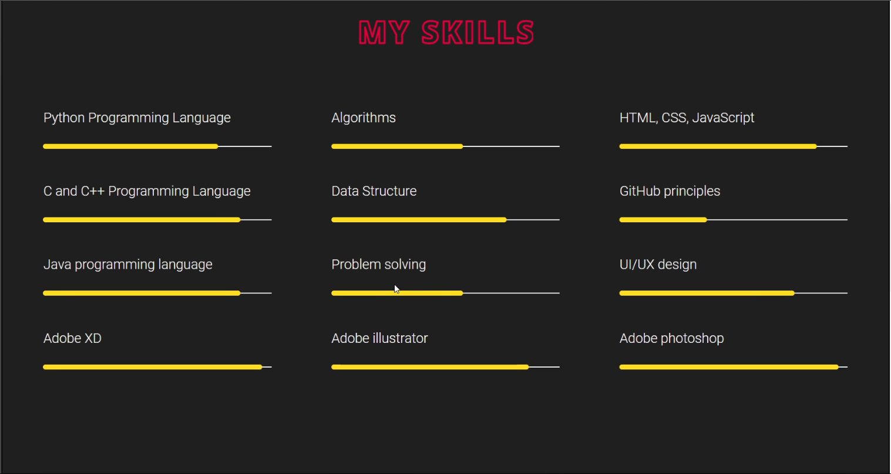
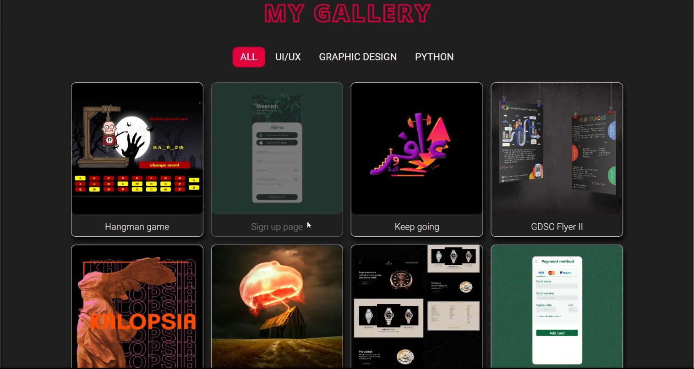
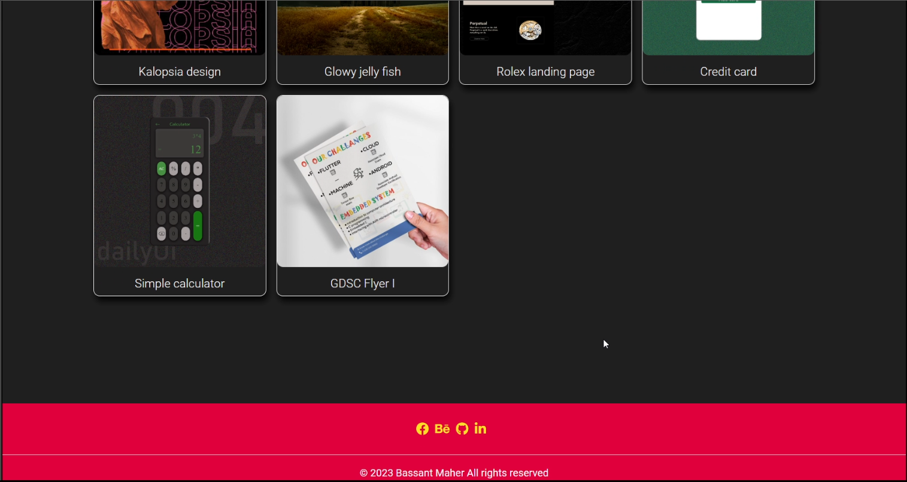
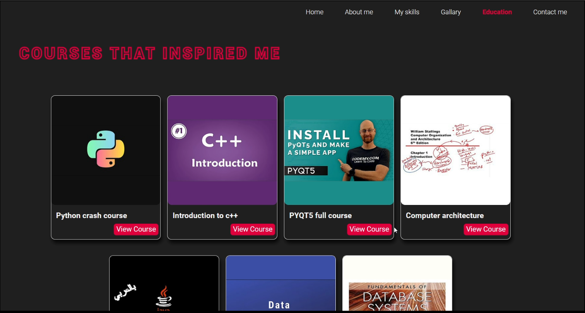
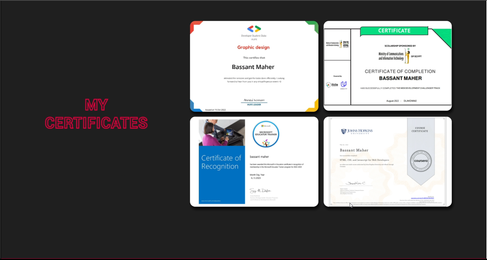

# Personal Portfolio

This repository contains the source code for my personal portfolio website, showcasing my skills, projects, and experiences.
















## Table of Contents
- [Introduction](#introduction)
- [Features](#features)
- [Technologies Used](#technologies-used)
- [Installation](#installation)
- [Usage](#usage)
- [Contributing](#contributing)


## Introduction
Welcome to my personal portfolio! This website serves as a platform to highlight my professional journey, projects I have worked on, and my skills in various technologies.

## Features
- **Home:** Overview of my portfolio.
- **About:** Detailed information about me.
- **Projects:** Showcase of my projects with descriptions and links.
- **Skills:** List of my technical and professional skills.
- **Contact:** Form to get in touch with me.

## Technologies Used
- HTML5
- CSS3
- JavaScript
- Bootstrap
- jQuery

## Installation
To run this project locally, follow these steps:

1. Clone the repository:
    ```bash
    git clone https://github.com/BassantMaher/Personal-Portfolio.git
    ```
2. Navigate to the project directory:
    ```bash
    cd Personal-Portfolio
    ```
3. Open `index.html` in your web browser to view the portfolio.

## Usage
Simply open the `index.html` file in a web browser to view the website. Customize the content as per your requirements by editing the HTML, CSS, and JavaScript files.

## Contributing
Contributions are welcome! If you have any suggestions or improvements, feel free to submit a pull request. Please follow these steps:

1. Fork the repository.
2. Create a new branch: `git checkout -b feature-branch`
3. Make your changes and commit them: `git commit -m 'Add some feature'`
4. Push to the branch: `git push origin feature-branch`
5. Submit a pull request.


